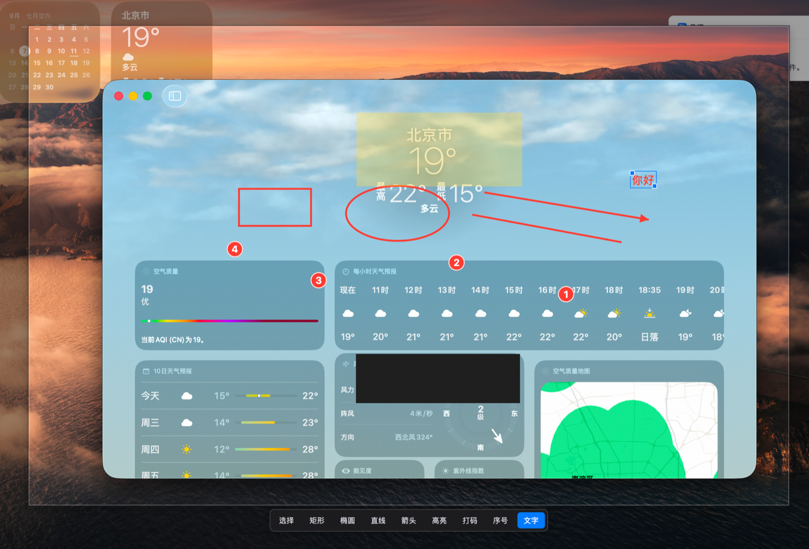

<div align="center">

# PinWall

**Pin screenshots to your screen.**

[English](README.md) · [简体中文](README.zh-CN.md)

Free, open-source screenshot and image-pinning software — free for commercial use, too.

`Available on macOS` · `Windows in development` · `Rust · no Electron · target resident memory < 30 MB`

</div>

---

When you are coding from a design, reading an error while consulting documentation, or comparing two sets of data, you do not need to save a screenshot somewhere. You need to **keep that piece of the screen in view**.

Press F1, drag out a region, and PinWall turns it into an always-on-top floating image right where it was captured. It stays above your apps and Spaces. Draw on it when needed, press Return to copy it, or press Esc to discard it.



<div align="center">
<sub>Immediately after selecting an area with F1: the dimmed surroundings show that this capture is still in progress; draw directly on the image with the toolbar below it.</sub>
</div>

## A capture, end to end

```
F1  →  drag to select  →  annotate in place  →  Return      copy it; leave nothing behind
                                             ⇧Return     keep it as a pinned floating image
                                             Esc         discard it
```

Selection does **not** finalize a capture immediately. The surrounding area remains dimmed to show that you are still in the capture flow. During this staging state, the image is already in place and the annotation toolbar is ready — no separate edit mode required.

Once you are done, choose where it goes:

| Key | Result |
|---|---|
| `Return` / `⌘C` / double-click empty space | Burn annotations into pixels, copy to the clipboard, and close — no window left behind |
| `⇧Return` | Burn annotations into pixels and keep the result as a pinned floating image |
| `Esc` / right-click the dimmed area | Discard this capture |

Most screenshots are copied somewhere and pasted, so the common path is deliberately short: **F1, select, Return**.

## What pinned images can do

A pin is not merely an image left on screen. It can take part in your work:

- **Drag** to move it; use the **scroll wheel** to zoom around the pointer; use **Shift/Option + wheel** to adjust opacity.
- Enable **mouse passthrough** (middle-click, or toggle all pins with `⌘⇧T`) to use a translucent pin as a guide over code while interacting normally with the editor beneath it.
- Move pins freely across Spaces, full-screen apps, and displays.
- Press `F3` to pin **any image on the clipboard** — copied from a browser or chat app, not only from PinWall.
- Double-click to copy and close safely; right-click to discard directly.

## Annotations

Nine tools are available from both the keyboard and toolbar. Annotations are **vector objects**: select, move, resize, and undo them after drawing; they are rasterized only when exporting.

| | | | |
|---|---|---|---|
| `V` Select | `R` Rectangle | `O` Ellipse | `L` Line |
| `A` Arrow | `H` Highlight | `B` Redact | `N` Number |
| `T` Text | | | |

A few deliberate choices:

- **Redaction uses an opaque solid color, not mosaic blur.** Pixelation has been reconstructed by algorithms; an opaque cover is safer for sensitive information.
- **Highlights are always fluorescent yellow**, independent of the active annotation color. A red translucent block reads as an error, not emphasis.
- **Number markers increment automatically.** Undo also rolls back the counter, so undoing “3” does not create a second “4”.
- **Text uses the system-native input field**, so IMEs, candidate panels, double-pinyin input, and the emoji picker work as expected.

## Keyboard shortcuts

**Global** — available from anywhere

| Key | Action |
|---|---|
| `F1` | Capture a region |
| `F3` | Pin an image from the clipboard |
| `⌘⇧X` | Close all pins |
| `⌘⇧T` | Toggle mouse passthrough for all pins |
| `⌘⇧E` | Enter or leave annotation mode (a fallback when focus is unusual) |

**Inside a pin** — a new capture receives focus automatically; click an existing pin first

| Key | Action |
|---|---|
| `Space` | Show or hide the annotation toolbar |
| `V R O L A H B N T` | Select an annotation tool |
| `⌘Z` | Undo an annotation |
| `⌘C` | Copy to the clipboard, including annotations |
| `⌘S` | Save as… and choose a location |
| `⌘⇧S` | Save quickly to the Desktop without interrupting work |
| `Esc` | Leave annotation mode; press again to close the pin |

**Mouse**

| Action | Result |
|---|---|
| Drag | Move the pin |
| Scroll | Zoom around the pointer |
| `Shift`/`Option` + scroll | Adjust opacity |
| Middle-click | Toggle mouse passthrough |
| Double-click | Copy to the clipboard and close |
| Right-click | Close without copying |

Global shortcuts are deliberately scarce: they reserve keys across **all** apps. Frequent tool shortcuts stay within the focused pin, where they affect only the current image.

## Install and run

PinWall is currently command-line only; it is not yet packaged as a `.app`.

```bash
git clone https://github.com/kinghy949/pinwall.git
cd pinwall
cargo run -p pinwall
```

On first run, grant **Screen Recording** permission in **System Settings → Privacy & Security → Screen Recording**, then run it again.

> Requires macOS 12.3 or later, the minimum version supported by ScreenCaptureKit.

## Why another screenshot tool?

Existing tools each excel at something, but none brings all of it together:

| | Strength | Missing piece |
|---|---|---|
| **Snipaste** | Exceptional pinning | Closed source, paid commercial use, no workflow automation |
| **ShareX** | Powerful features and workflows | Windows-only and intimidating to configure |
| **CleanShot X** | Highly polished experience | macOS-only and paid |
| **Snagit** | Comprehensive professional tooling | Subscription model; oriented toward team documentation |
| **Lightshot** | Fast and simple | Limited feature set and stalled maintenance |
| **Greenshot** | Lightweight and dependable | Dated UI; macOS version costs extra |

**No other tool combines image pinning with automated post-capture workflows.** Snipaste has pinning without workflows; ShareX has workflows without pinning and only on Windows. PinWall lives in that intersection.

What PinWall deliberately does **not** do matters just as much:

- **No paywall:** no Pro tier, feature gating, or subscription; commercial use remains free.
- **No accounts:** a screenshot tool should not require registration.
- **No telemetry:** no data collection by default.
- **No forced cloud:** local-first; uploads are optional and self-hosting is supported.
- **No single-platform future:** Windows and macOS are first-class, with consistent behavior and shortcuts.

> **Platform note:** Linux is experimental and limited to X11 / XWayland. Wayland disallows client-controlled window placement at the protocol level, while arbitrary positioning is essential to pinning. See the [MVP risk assessment](docs/mvp-risks.md#r1-wayland-上贴图基本无法实现--linux-必须降级) for details (currently in Chinese).

## Progress

**The full flow works on macOS. Windows and Linux have not yet begun.**

MVP:

- [x] Region and multi-display capture (including cross-display selection, capture, and compositing)
- [x] **Pinning:** always-on-top floating windows with zoom, opacity, mouse passthrough, and cross-display dragging
- [x] Pin an image from the clipboard (`F3`)
- [x] Annotations: rectangle, ellipse, line, arrow, highlight, redaction, number, and text
- [x] Rasterized annotated exports (copy / Save As / quick save)
- [x] Global keyboard shortcuts
- [ ] Window capture / full-screen capture
- [ ] Pin groups
- [ ] Windows backend
- [ ] Application packaging (`.app` / installer)

Later:

- [ ] Screenshot history: card timeline and full-text search
- [ ] Composable post-capture workflows
- [ ] Scrolling screenshots
- [ ] OCR text extraction
- [ ] Plugin API (the community can extend upload targets and integrations)
- [ ] Screen recording and GIF export
- [ ] Custom upload targets (S3 / WebDAV / custom HTTP)
- [ ] Cross-device settings sync

## Technology

Performance is a hard constraint, not an optimization: **resident memory < 30 MB; hotkey-to-selection-overlay < 50 ms**.

- **Pure Rust**, with no WebView. Electron (150 MB+ resident memory) and Tauri (60–100 MB of resident WebView process memory plus cold-start delay) are intentionally excluded from this hot path.
- Windows and drawing use native platform APIs directly. On macOS, that is `NSPanel` + direct CoreGraphics rendering. The original selection considered `egui` / `wgpu`, but a capture overlay and annotations need only a few rectangles and text — not a full GUI framework.
- Screen capture uses native APIs: ScreenCaptureKit / Windows.Graphics.Capture / PipeWire.
- The resident process keeps only hotkeys and the tray alive; other capabilities load on demand.

The architecture is split into `pinwall-core` (platform-independent state machine and annotation model), `pinwall-capture` (capture and encoding), `pinwall-platform` (windows, drawing, clipboard, and other platform integrations), and `pinwall` (application composition). Traits and placeholder implementations for the Windows backend are already in place.

## Documentation

- [Competitor research: top five screenshot tools](docs/research.md) (Chinese)
- [Technology choices](docs/tech-stack.md) (Chinese)
- [MVP risk assessment](docs/mvp-risks.md) (Chinese)

## Contributing

At this stage, the most valuable contributions are ideas: which feature from which tool can you not live without? Which design choices feel like friction? Please open an issue.

## License

[MIT](LICENSE)
